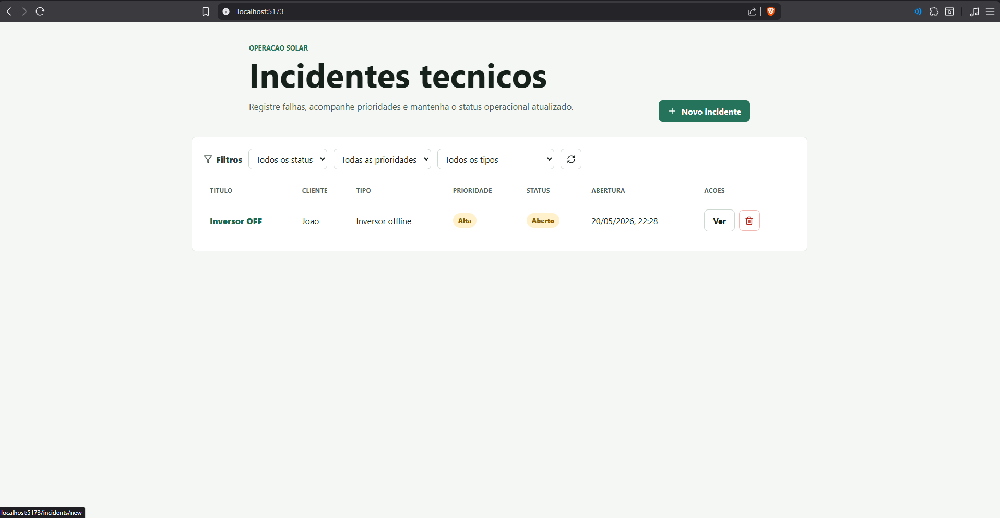
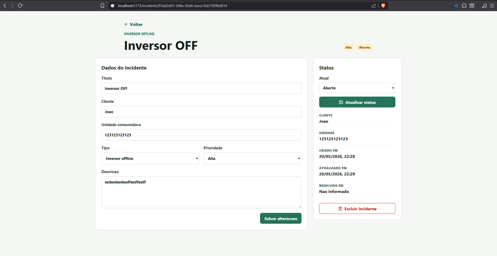
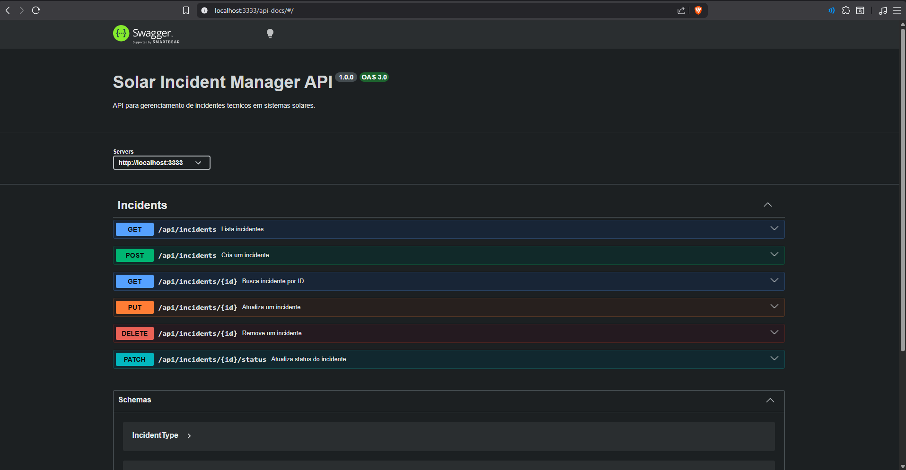

# Solar Incident Manager

Sistema para registro, acompanhamento e resolucao de incidentes tecnicos em sistemas solares.

O projeto foi criado como teste tecnico para demonstrar uma funcionalidade ponta a ponta com API, persistencia, validacoes, logs, testes automatizados e documentacao.

## Funcionalidades

- Cadastro de incidentes tecnicos
- Listagem e consulta por ID
- Edicao de dados do incidente
- Alteracao de status
- Exclusao de incidentes
- Filtros por status, prioridade e tipo
- Preenchimento automatico de `resolvedAt` ao resolver um incidente

## Tecnologias

### Back-end

- Node.js
- TypeScript
- Express
- Prisma
- SQLite
- Zod
- Jest
- Supertest
- Winston
- Swagger/OpenAPI

### Front-end

- React
- TypeScript
- Vite
- Axios
- React Hook Form
- Zod

## Como executar

### Back-end

```bash
cd backend
npm install
cp .env.example .env
npm run prisma:migrate
npm run dev
```

A API ficara disponivel em:

```txt
http://localhost:3333
```

A documentacao Swagger ficara em:

```txt
http://localhost:3333/api-docs
```

### Testes do back-end

```bash
cd backend
npm test
```

### Front-end

```bash
cd frontend
npm install
npm run dev
```

A interface ficara disponivel em:

```txt
http://localhost:5173
```

## Prints

### Front-end



### Detalhes do incidente



### Back-end e testes



## Status do projeto

O projeto ja contempla o fluxo principal pedido no teste tecnico:

- API com CRUD de incidentes
- Validacao de entrada com Zod
- Persistencia com Prisma e SQLite
- Logs com Winston
- Documentacao Swagger em `/api-docs`
- Testes automatizados dos principais endpoints
- Front-end com listagem, filtros, cadastro, edicao, status e exclusao
- Documentacao tecnica e analise de incidente em `docs`

Antes de enviar para a vaga, rode:

```bash
cd backend
npm test
npm run build
```

```bash
cd frontend
npm run build
```

## Endpoints principais

| Metodo | Rota | Descricao |
| --- | --- | --- |
| GET | `/api/incidents` | Lista incidentes |
| GET | `/api/incidents/:id` | Busca incidente por ID |
| POST | `/api/incidents` | Cria incidente |
| PUT | `/api/incidents/:id` | Atualiza incidente |
| PATCH | `/api/incidents/:id/status` | Atualiza status |
| DELETE | `/api/incidents/:id` | Remove incidente |

## Exemplo de incidente

```json
{
  "title": "Inversor offline",
  "description": "Inversor sem comunicacao desde ontem.",
  "clientName": "Joao da Silva",
  "unitCode": "3020547862",
  "type": "INVERTER_OFFLINE",
  "priority": "HIGH"
}
```

## Documentos adicionais

- [Nota tecnica](docs/nota-tecnica.md)
- [Analise de incidente](docs/analise-incidente.md)
